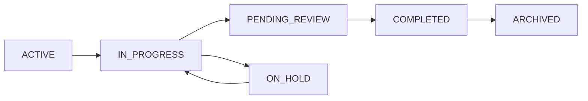

# Forms System Technical Documentation

## Architecture Overview

### Component Structure
```
src/app/forms/
├── page.tsx                 # Main forms page
├── templates/
│   ├── page.tsx            # Templates listing page
│   ├── [id]/
│   │   └── page.tsx        # Template detail/edit page
├── instances/
│   ├── page.tsx            # Instances listing page
│   └── [instanceId]/
│       └── page.tsx        # Instance detail page
└── components/
    ├── FormBuilder.tsx     # Form template builder
    ├── FormInstance.tsx    # Form instance viewer
    └── StatusManager.tsx   # Status management
```

## Database Schema

### Form Templates
```prisma
model FormTemplate {
  id          String   @id @default(cuid())
  name        String
  description String?
  type        String
  departmentId String
  workflowId   String?
  phaseId      String?
  createdAt   DateTime @default(now())
  updatedAt   DateTime @updatedAt
  // Relations
  instances    FormInstance[]
  department   Department    @relation(fields: [departmentId], references: [id])
  workflow     Workflow?     @relation(fields: [workflowId], references: [id])
  phase        Phase?        @relation(fields: [phaseId], references: [id])
}
```

### Form Instances
```prisma
model FormInstance {
  id          String   @id @default(cuid())
  templateId  String
  status      FormInstanceStatus
  projectId   String?
  taskId      String?
  createdAt   DateTime @default(now())
  updatedAt   DateTime @updatedAt
  // Relations
  template    FormTemplate @relation(fields: [templateId], references: [id])
  project     Project?    @relation(fields: [projectId], references: [id])
  task        Task?       @relation(fields: [taskId], references: [id])
  statusHistory FormStatusHistory[]
}
```

## API Routes

### Form Templates
- `GET /api/forms/templates` - List all templates
- `POST /api/forms/templates` - Create new template
- `GET /api/forms/templates/[id]` - Get template details
- `PATCH /api/forms/templates/[id]` - Update template
- `DELETE /api/forms/templates/[id]` - Delete template

### Form Instances
- `GET /api/forms/instances` - List all instances
- `POST /api/forms/instances` - Create new instance
- `GET /api/forms/instances/[instanceId]` - Get instance details
- `PATCH /api/forms/instances/[instanceId]/status` - Update instance status
- `POST /api/forms/instances/batch` - Batch update instances

## Status Management

### Status Flow


### Status Validation
```typescript
const isValidStatusTransition = (
  currentStatus: FormInstanceStatus,
  newStatus: FormInstanceStatus
): boolean => {
  const validTransitions: Record<FormInstanceStatus, FormInstanceStatus[]> = {
    ACTIVE: ['IN_PROGRESS'],
    IN_PROGRESS: ['PENDING_REVIEW', 'ON_HOLD'],
    PENDING_REVIEW: ['COMPLETED', 'IN_PROGRESS'],
    COMPLETED: ['ARCHIVED'],
    ARCHIVED: [],
    ON_HOLD: ['IN_PROGRESS']
  }
  return validTransitions[currentStatus].includes(newStatus)
}
```

## Dependencies Management

### Dependency Graph
- Uses force-directed graph layout
- Nodes represent form instances
- Edges represent dependencies
- Color coding based on status
- Interactive zoom and pan controls

### Performance Considerations
1. Lazy loading for large form lists
2. Optimistic updates for status changes
3. Batch processing for multiple updates
4. Caching strategies for template data

## Security

### Access Control
- Role-based access control (RBAC)
- Department-level permissions
- Audit logging for status changes
- Validation of status transitions

### Data Validation
- Zod schemas for form data
- Input sanitization
- XSS prevention
- CSRF protection

## Testing

### Unit Tests
- Form template validation
- Status transition logic
- Dependency resolution

### Integration Tests
- API endpoint testing
- Database operations
- Status update workflows

### E2E Tests
- Form creation flow
- Instance management
- Batch operations
- Status transitions 